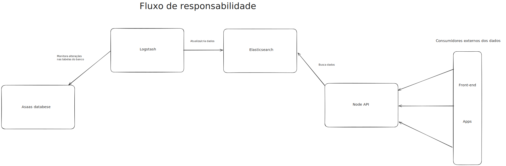
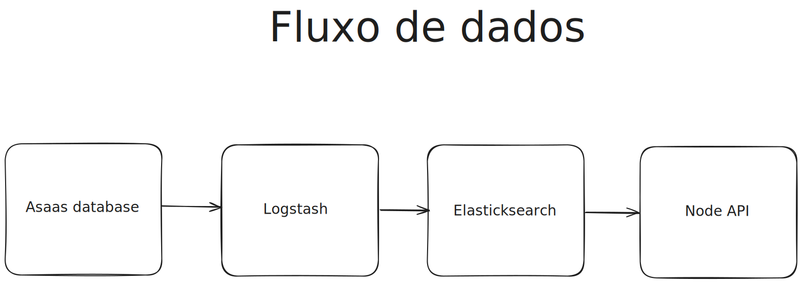

# Projeto de Integração ELK com MySQL e API

Este projeto configura um ambiente de integração entre Elasticsearch, Logstash, Kibana (ELK Stack) e MySQL usando Docker Compose. O objetivo é extrair dados de um banco de dados MySQL e indexá-los no Elasticsearch para visualização no Kibana.

## Como Executar

1. Certifique-se de ter o Docker e o Docker Compose instalados.
2. Execute o comando `docker-compose up` na raiz do projeto.
3. Execute o comando `sudo docker network connect elk-stack-node-api-ex_default containers-db-1` na raiz do projeto. Este comando conecta o contêiner do banco de dados MySQL à rede padrão criada pelo Docker Compose, permitindo que o Logstash acesse o MySQL.
4. Acesse o Kibana em [http://localhost:5601](http://localhost:5601) para visualizar os dados indexados.

## Como Visualizar Dados no Kibana

1. **Acesse o Kibana:**

   - Abra o navegador e vá para [http://localhost:5601](http://localhost:5601).

2. **Verifique os Índices Criados:**

   - Navegue até a seção de gerenciamento de índices em [http://localhost:5601/app/management/data/index_management/indices](http://localhost:5601/app/management/data/index_management/indices).
   - Verifique se os índices `users` e `products` foram criados corretamente.

3. **Crie um Padrão de Índice (Index Pattern):**

   - Vá para [http://localhost:5601/app/management/kibana/indexPatterns](http://localhost:5601/app/management/kibana/indexPatterns).
   - Clique em "Create index pattern".
   - No campo "Index pattern", digite `users` e clique em "Next step".
   - Selecione o campo `@timestamp` como o campo de filtro de tempo e clique em "Create index pattern".
   - Repita o processo para o índice `products`.

4. **Visualize os Dados no Discover:**

   - Navegue até a seção Discover em [http://localhost:5601/app/discover](http://localhost:5601/app/discover).
   - No menu suspenso de seleção de índice, escolha `users` para visualizar os dados dos usuários.
   - Explore os dados utilizando os filtros e visualizações disponíveis.
   - Para visualizar os dados dos produtos, selecione o índice `products` no menu suspenso de seleção de índice.

5. **Crie Visualizações e Dashboards:**
   - Vá para [http://localhost:5601/app/visualize](http://localhost:5601/app/visualize) para criar visualizações baseadas nos dados dos índices.
   - Utilize gráficos de barras, linhas, tortas, entre outros, para representar os dados.
   - Para criar dashboards, vá para [http://localhost:5601/app/dashboards](http://localhost:5601/app/dashboards) e combine várias visualizações em um único painel.

## Arquivo .env

O arquivo .env na raiz do projeto contém as variáveis de ambiente necessárias para o aplicativo Node.js:

PORT=3000
ELASTICSEARCH_NODE=http://localhost:9200

## Arquivo request.http

O arquivo request.http permite testar os endpoints do aplicativo Node.js diretamente do VS Code:

### Get all customers

GET http://localhost:3000/customers
Content-Type: application/json

### Get customers by id

GET http://localhost:3000/customers?id=1
Content-Type: application/json

### Get customers by email

GET http://localhost:3000/customers?email=test@example.com
Content-Type: application/json

### Get customers by cpf_cnpj

GET http://localhost:3000/customers?cpf_cnpj=12345678900
Content-Type: application/json

### Get customers by name

GET http://localhost:3000/customers?name=John Doe
Content-Type: application/json

### Get customers by multiple filters

GET http://localhost:3000/customers?id=1&email=test@example.com&cpf_cnpj=12345678900&name=John Doe
Content-Type: application/json

## Serviços

### Elasticsearch

- Imagem: `docker.elastic.co/elasticsearch/elasticsearch:8.12.0`
- Porta: `9200`
- Volumes: `./data/elasticsearch_data:/usr/share/elasticsearch/data`
- Configuração: Executado como um nó único com segurança desativada para simplificação.

### Kibana

- Imagem: `docker.elastic.co/kibana/kibana:8.12.0`
- Porta: `5601`
- Dependências: `elasticsearch`
- Configuração: Conectado ao Elasticsearch para visualização dos dados indexados.

### Logstash

- Imagem: `docker.elastic.co/logstash/logstash:8.12.0`
- Volumes:
  - Arquivos de configuração das pipelines para `users` e `products`.
  - Conector JDBC para MySQL.
- Dependências: `elasticsearch`, `mysql`
- Configuração: Duas pipelines separadas para processar dados de `users` e `products` do MySQL e indexá-los no Elasticsearch.

### Node.js App

- Imagem: Construída a partir do Dockerfile localizado em ./app
- Porta: 3000
- Volumes:
  - ./app:/app
  - /app/node_modules
- Configuração: Aplicativo Node.js configurado para consumir dados do Elasticsearch e expor endpoints para consulta.

## Configuração do Logstash

Os arquivos de configuração do Logstash estão localizados na pasta `logstash/pipeline`. Eles definem a entrada de dados a partir do MySQL e a saída para o Elasticsearch. As pipelines são configuradas para rodar a cada minuto e rastrear atualizações na tabela `customer`.

## Representação do fluxo

